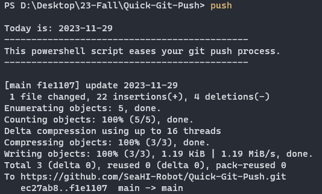

# Ease Your Git Push!

> Push you git repository in real quick!


## Description

> **Bash** / **PowerShell** / **python** scripts that help you ease your "git push" process. 


Use an `push` alias in terminal to `git add .` , `git commit -m "commit-message"` and `git push`.


The scripts were tested and work well on ubuntu & windows environments.


## Characteristic
- The bash and powershell script directly push your repo with the commit messgae fotmat `update year-month-day`
- The python script enable custom commit message, the commit messgae fotmat `update year-month-day` by default.

<br>

- Demo in PowerShell:



## Usage

<details>   
    <summary>Bash - ubuntu</summary>

    1. Copy `quick_git_push.sh` into a safe directory.
    
    2. Add `alias push='. <directory_to_quick_git_push.sh>/quick_git_push.sh'` into your `.bashrc` or `.bash_aliases` profile. You can modify *"push"* to any other alias you like.
    
    3. `$ cd <your_git_repo>`, run the alias in Bash terminal: `$ push` (*"push"* in my case, make sure the .`bashrc` profile is sourced before using)
    
    4. **Notice!** If you are using the **python** script, **do not configure `quick_git_push.sh`** to avoid repetition of terminal command.
    
    5. **Usage**: 
    	```
    	$ cd <path-to-your-repo>
    	$ push
    	```
    	**Commit message format is fixed in this script**

</details>


<details>   
    <summary>Python - ubuntu</summary>

    1. Download `quick_git_push.py` and make it an executable file.
    
    2. Copy quick_git_push.py with an alias to `$ sudo mv <path-to-quick_git_push.py>/quick_git_push.py /usr/local/bin/push`; Or instead, use a bash alias to call `quick_git_push.py`, which requires you to configure your `.bashrc` or `.bash_aliases`, for examlple, add `alias push="python3 <path-to-quick_git_push.py>/quick_git_push.py`.
    
    3. `$ cd <your_git_repo>`, run the alias in Bash terminal: `$ push` (*"push"* in my case, make sure the .`bashrc` profile is sourced before using).
    
    4. **Notice!** If you are using the **bash** script, **do not configure `quick_git_push.py`** to avoid repetition of terminal command. 
    
    5. **Usage**: 
    	```
    	$ cd <path-to-your-repo>
    	$ push "<commit-message, optinal>"
    	```

</details>


<details>
    <summary>powershell - windows</summary>

    1.  Run `Set-ExecutionPolicy RemoteSigned` in your PowerShell to make sure PowerShell scripts with the suffix `.ps1` are executable. (Administrator privileges may be required).
    
    2.  In PowerShell, run`$PROFILE` to find the directory to the Powershell profile `Microsoft.PowerShell_profile.ps1Microsoft.PowerShell_profile.ps1`, if it doesn't exit, run `New-Item -Type File -Path $profile -Force` to create it.
    
    3.  Copy `quick_git_push.ps1` into a safe directory.
    
    4.  Add `New-Alias -Name push -Value <directory_to_quick_git_push.sh>\quick_git_push.ps1` into `Microsoft.PowerShell_profile.ps1`. You can modify *"push"* to any other alias you like.
    
    5. **Usage**: 
    	```
    	$ cd <path-to-your-repo>
    	$ push 
    	```
    	**Commit message format is fixed in this script**

</details>


## Notice!

As shown blow, the git commit format is fixed, so ***do not use the scripts (except for `quick_git_push.py`) in projects with strict commit format requirements.***


Inside `quick_git_push.sh`, as a reference to the commit message:

```bash
......

# Get date from your computer system
today=$(date +"%y.%m.%d")

# execute git commit
git commit -m "update $today"

......
```

